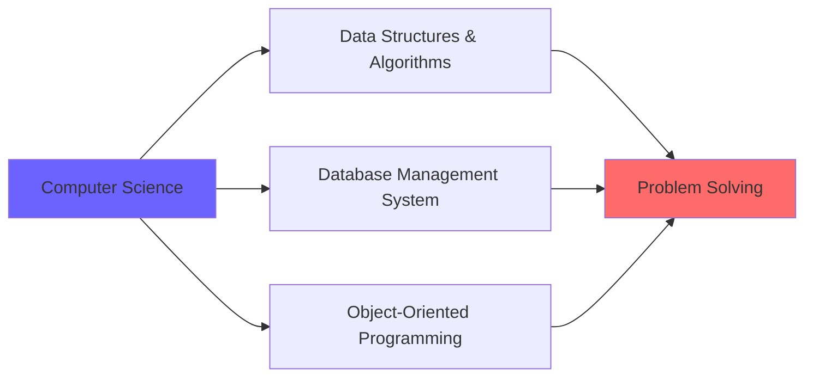

<div align="center">

<!-- Animated Header -->


<!-- Typing Animation -->
<p align="center">
  
</p>

<!-- Badges -->
<p align="center">
  
  
  
</p>

<!-- Social Links with Animation -->
<p align="center">
  <a href="https://linkedin.com/in/sania-shukla20">
    
  </a>
  <a href="mailto:saniashukla01@gmail.com">
    
  </a>
  <a href="https://github.com/sania20-ss">
    
  </a>
</p>

</div>

---

## 👩‍💻 About Me

```javascript
const sania = {
    role: "Software Development Engineer Intern",
    education: "Computer Science Engineering Student",
    location: "Bhopal, India 🇮🇳",
    passions: ["Frontend Development", "UI/UX Design", "Problem Solving"],
    currentFocus: "Building scalable web applications with modern frameworks",
    funFact: "I turn coffee into code and ideas into pixel-perfect UIs ☕✨"
};
```


- 🔭 Currently working on **production-level projects** at Medorn Ventures
- 🌱 Learning **Next.js** and advanced **React patterns**
- 👯 Looking to collaborate on **open-source frontend projects**
- 💬 Ask me about **React, UI/UX, and Web Development**
- ⚡ Fun fact: **3rd position winner** in College Web Design Competition

<br clear="right"/>

---

## 💼 Professional Experience

<details open>
<summary><b>🚀 Software Development Engineer Intern</b> @ Medorn Ventures Pvt. Ltd.</summary>
<br>

**📍 On-Site | 📅 July 2025 – Present**

```diff
+ Developed responsive web interfaces using React.js and Bootstrap
+ Optimized UI performance for production-ready modules
+ Integrated geolocation-based interactive features
+ Collaborated in Agile sprints with Git/GitHub workflows
+ Building static chatbot module for enhanced user engagement
```

**Key Achievements:**
- 🎯 Delivered pixel-perfect UI/UX implementations
- 🔄 Implemented feature branching and code review processes
- 📱 Enhanced user experience through third-party integrations

</details>

---

## 🛠️ Tech Stack

<div align="center">

### Languages


### Frameworks & Libraries


### Databases & Tools


</div>

---

## 🚀 Featured Projects

<div align="center">

<table>
<tr>
<td width="50%">

### 🎯 Predict Hire
**AI-Powered Interview Assessment Platform**


**Tech Stack:**
- React.js, Node.js, Express.js
- MongoDB, Firestore
- Gemini API, Clerk Auth
- Razorpay Integration

**Features:**
- ✨ AI-driven mock interviews
- 🎤 Audio recording & analysis
- 📊 Automated feedback & scoring
- 💳 Payment gateway integration

</td>
<td width="50%">

### 📋 Taskify
**Smart Task Management System**


**Tech Stack:**
- React.js
- Tailwind CSS
- JavaScript

**Features:**
- ✅ Real-time task tracking
- ⏰ Deadline-based reminders
- 🎨 Clean, intuitive UI
- 📱 Responsive design

</td>
</tr>
</table>

</div>

---

## 📊 GitHub Stats

<div align="center">
  
  
</div>

<div align="center">
  
</div>

<div align="center">
  
</div>

---

## 🏆 Achievements & Milestones

<div align="center">

| 🥉 Achievement | 📝 Description |
|:---:|:---|
| **🏅 3rd Position** | College Web Design Competition (Cash Prize Winner) |
| **☁️ Google Cloud** | Arcade Program Milestone Achiever |
| **✍️ Creative Writing** | Writing Challenge Competition Winner |
| **🏃‍♀️ Sports** | School Representative in Yoga & Athletics |

</div>

---

## 📚 Coursework

<div align="center">



</div>

- 📊 **Data Structures and Algorithms**
- 💾 **Database Management System**
- ☕ **Object-Oriented Programming (Java)**

---

## 🎯 Soft Skills

<div align="center">

| Skill | Proficiency |
|:---:|:---:|
| 🤝 Team Collaboration | ████████████ 95% |
| 💬 Communication | ███████████░ 90% |
| 🧩 Problem Solving | ████████████ 95% |
| 🎨 UI/UX Design | ███████████░ 88% |
| ⏱️ Time Management | ██████████░░ 85% |

</div>

---

## 📫 Let's Connect!

<div align="center">


**I'm always open to interesting conversations and collaboration opportunities!**

<p>
  <a href="mailto:saniashukla01@gmail.com">
    
  </a>
  <a href="https://linkedin.com/in/sania-shukla20">
    
  </a>
</p>

</div>

---

<div align="center">

### 💭 Quote of the Day


</div>

---

<div align="center">

### 👀 Profile Views Counter


**Thanks for visiting! 😊**


</div>
